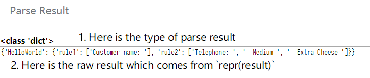

# uniparser [](https://badge.fury.io/py/uniparser)

Provide a universal solution for crawler platforms, for Python3.6+.

## Install

> pip install uniparser -U

## Why?

1. Reduced the code quantity from plenty of similar crawlers & parsers.  Don't Repeat Yourself.
2. Make the parsing process of different parsers persistent.
3. Separating parsing processes from the downloading.
4. Provide a universal solution for crawler platforms.
5. Summarize common string parsing tools on the market.

## Feature List

0. Each ParseRule / CrawlerRule / HostRules object could be json.dumps for persistence.
   1. Therefore, they also can be loads from JSON string
1. Support most of popular parsers for HTML / XML / JSON / AnyString / Python object
   1. css
   2. xml
   3. regex
   4. jsonpath
      1. quite slow...
   5. objectpath
   6. jmespath
   7. time
   8. yaml / toml
2. 

## Quick Start

```python
# -*- coding: utf-8 -*-
from urllib.parse import urlparse

import requests
from uniparser import CrawlerRule, HostRules, Uniparser


def test_default_usage():
    # 1. prepare for storage to save {'host': HostRules}
    uni = Uniparser()
    storage = {}
    test_url = 'http://httpbin.org/get'
    crawler_rule = CrawlerRule(
        'test_crawler_rule',
        {
            'url': 'http://httpbin.org/get',
            'method': 'get'
        },
        [{
            "name": "rule1",
            "chain_rules": [
                ['objectpath', 'JSON.url', ''],
                ['python', 'getitem', '[:4]'],
                ['udf', '(context.url, input_object)', ''],
            ],
            "child_rules": []
        }],
        'https?://httpbin.org/get',
    )
    host = urlparse(test_url).netloc
    hrs = HostRules(host=host)
    hrs.add(crawler_rule)
    # same as: json_string = hrs.to_json()
    json_string = hrs.dumps()
    # print(json_string)
    assert json_string == r'{"host": "httpbin.org", "crawler_rules": [{"name": "test_crawler_rule", "parse_rules": [{"name": "rule1", "chain_rules": [["objectpath", "JSON.url", ""], ["python", "getitem", "[:4]"], ["udf", "(context.url, input_object)", ""]], "child_rules": []}], "request_args": {"url": "http://httpbin.org/get", "method": "get"}, "regex": "https?://httpbin.org/get"}]}'
    # 2. add HostRules to storage, sometimes save on redis
    storage[hrs['host']] = json_string
    # ============================================
    # start to crawl
    # 1. set a example url
    test_url1 = test_url
    # 2. find the HostRules
    json_string = storage.get(host)
    # 3. HostRules init: load from json
    # same as: hrs = HostRules.from_json(json_string)
    hrs = HostRules.loads(json_string)
    # print(crawler_rule)
    # 4. now search / match the url with existing rules
    crawler_rule = hrs.search(test_url1)
    # print(crawler_rule)
    assert crawler_rule == {
        'name': 'test_crawler_rule',
        'parse_rules': [{
            'name': 'rule1',
            'chain_rules': [['objectpath', 'JSON.url', ''],
                            ['python', 'getitem', '[:4]'],
                            ['udf', '(context.url, input_object)', '']],
            'child_rules': []
        }],
        'request_args': {
            'url': 'http://httpbin.org/get',
            'method': 'get'
        },
        'regex': 'https?://httpbin.org/get'
    }
    # print(hrs.match(test_url1))
    assert crawler_rule == hrs.match(test_url1)
    # 5. send request as crawler_rule's request_args, download the page source code
    resp = requests.request(**crawler_rule['request_args'])
    source_code = resp.text
    # 6. parse the whole crawler_rule as crawler_rule's with uniparser. set context with resp
    assert isinstance(crawler_rule, CrawlerRule)
    result = uni.parse(source_code, crawler_rule, context=resp)
    # print(result)
    assert result == {
        'test_crawler_rule': {
            'rule1': ('http://httpbin.org/get', 'http')
        }
    }
    # ===================== while search failed =====================
    # given a url not matched the pattern
    test_url2 = 'http://notmatch.com'
    crawler_rule2 = hrs.search(test_url2)
    assert crawler_rule2 is None
    # ===================== shared context =====================
    # !!! use context by updating rule.context variable
    new_parse = '''
def parse(input_object):
    context['new_key'] = 'cleared'
    return (input_object, context)
    '''
    crawler_rule.context.update({'new_key': 'new_value'})
    crawler_rule.clear_parse_rules()
    crawler_rule.add_parse_rule({
        'name': 'rule1',
        'chain_rules': [['objectpath', 'JSON.url', ''],
                        ['python', 'getitem', '[:4]'], ['udf', new_parse, '']],
        'child_rules': []
    })
    result = uni.parse(source_code, crawler_rule)
    # print(result)
    assert result == {
        'test_crawler_rule': {
            'rule1': ('http', {
                'new_key': 'cleared'
            })
        }
    }
    # print(crawler_rule.context)
    # now the crawler_rule.context has been updated.
    assert crawler_rule.context == {'new_key': 'cleared'}


if __name__ == "__main__":
    test_default_usage()

```

## More Usage

> Talk is cheap, code == doc.  ^_^

Watch the examples: [test_parsers.py](https://github.com/ClericPy/uniparser/blob/master/test_parsers.py)

## Uniparser Test Console Demo (Web UI)

### 1. Install the requirements.

    > pip install bottle uniparser
    > python webui_bottle.py

### 2. open browser:  http://127.0.0.1:8080/ 

#### 2.1 Web UI start page


#### 2.2 Prepare the rules


#### 2.3 Read the parse result



## TODO

- [x] Release to **pypi.org**
- [x] Add **github actions** for testing package
- [ ] Web UI for testing rules
- [ ] Complete the whole doc
