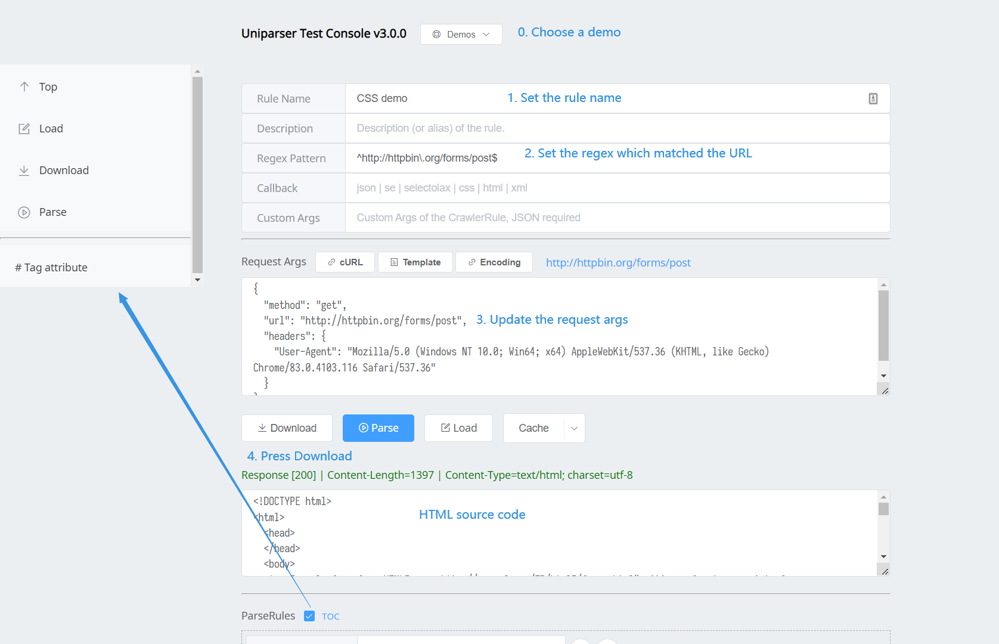
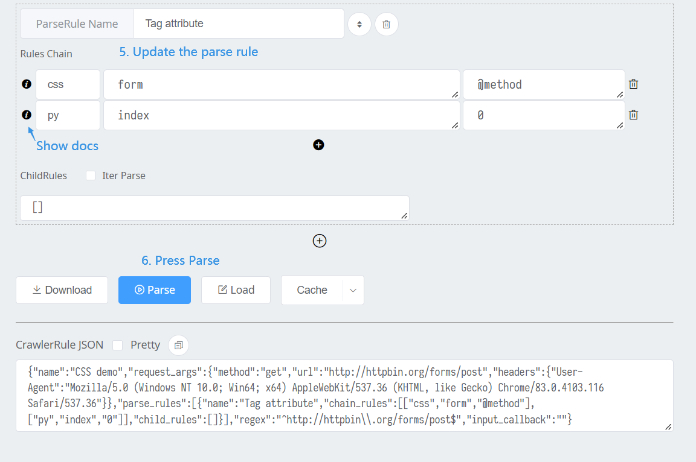

# uniparser [](https://badge.fury.io/py/uniparser)

Provide a universal solution for crawler, **Python3.6+**.

## Install

> pip install uniparser -U

## Why?

1. Reduced the code quantity from plenty of similar crawlers & parsers.  Don't Repeat Yourself.
2. Make the parsing process of different parsers persistent.
3. Separating the crawler code from main app code, no need to redeploy app when adding a new crawler.
4. Provide a universal solution for crawler platforms.
5. Summarize common string parsing tools on the market.

## Feature List

1. Support most of popular parsers for HTML / XML / JSON / AnyString / Python object
   1. <details>
        <summary>parser list</summary>
      
            1. css (HTML)
                1. bs4
            2. xml
                1. lxml
            3. regex
            4. jsonpath
                1. jsonpath_ng
            5. objectpath
                1. objectpath
            6. jmespath
                1. jmespath
            7. time
            8. loader
                1. json / yaml / toml
                    1. toml
                    2. pyyaml
            9. udf
                1. source code for exec & eval which named as **parse**
            10. python
                1. some  common python methods, getitem, split, join...
            11. *waiting for new ones...*
      
      </details>
      
2. Request args persistence, support curl-string, single-url, dict, json.
3. A simple Web UI for generate & test CrawlerRule.
4. Serializable JSON rule class for saving the whole parsing process.
   1. Each ParseRule / CrawlerRule / HostRule subclass can be json.dumps to JSON for persistence.
   2. Therefore, they also can be loaded from JSON string.
   3. Nest relation of rule names will be treat as the result format. (Rule's result will be ignore if has childs.)

## Quick Start

> Mission: Crawl python [Meta-PEPs](https://www.python.org/dev/peps/#id6)
>
> Only less than 25 lines necessary code besides the rules(which can be saved outside and auto loaded).
> 
> HostRules will be saved at `$HOME/host_rules.json` by default, not need to init every time.

<details>
    <summary>CrawlerRule JSON & Expected Result</summary>

```python
# These rules will be saved at `$HOME/host_rules.json`
crawler = Crawler(
    storage=JSONRuleStorage.loads(
        r'{"www.python.org": {"host": "www.python.org", "crawler_rules": {"main": {"name":"list","request_args":{"method":"get","url":"https://www.python.org/dev/peps/","headers":{"User-Agent":"Mozilla/5.0 (Windows NT 10.0; Win64; x64) AppleWebKit/537.36 (KHTML, like Gecko) Chrome/79.0.3945.130 Safari/537.36"}},"parse_rules":[{"name":"__request__","chain_rules":[["css","#index-by-category #meta-peps-peps-about-peps-or-processes td.num>a","@href"],["re","^/","@https://www.python.org/"],["python","getitem","[:3]"]],"childs":""}],"regex":"^https://www.python.org/dev/peps/$","encoding":""}, "subs": {"name":"detail","request_args":{"method":"get","url":"https://www.python.org/dev/peps/pep-0001/","headers":{"User-Agent":"Mozilla/5.0 (Windows NT 10.0; Win64; x64) AppleWebKit/537.36 (KHTML, like Gecko) Chrome/79.0.3945.130 Safari/537.36"}},"parse_rules":[{"name":"title","chain_rules":[["css","h1.page-title","$text"],["python","getitem","[0]"]],"childs":""}],"regex":"^https://www.python.org/dev/peps/pep-\\d+$","encoding":""}}}}'
    ))
expected_result = {
    'list': {
        '__request__': [
            'https://www.python.org/dev/peps/pep-0001',
            'https://www.python.org/dev/peps/pep-0004',
            'https://www.python.org/dev/peps/pep-0005'
        ],
        '__result__': [{
            'detail': {
                'title': 'PEP 1 -- PEP Purpose and Guidelines'
            }
        }, {
            'detail': {
                'title': 'PEP 4 -- Deprecation of Standard Modules'
            }
        }, {
            'detail': {
                'title': 'PEP 5 -- Guidelines for Language Evolution'
            }
        }]
    }
}

```

</details>

<details>
  <summary>The Whole Source Code</summary>

```python
from uniparser import Crawler, JSONRuleStorage
import asyncio

crawler = Crawler(
    storage=JSONRuleStorage.loads(
        r'{"www.python.org": {"host": "www.python.org", "crawler_rules": {"main": {"name":"list","request_args":{"method":"get","url":"https://www.python.org/dev/peps/","headers":{"User-Agent":"Mozilla/5.0 (Windows NT 10.0; Win64; x64) AppleWebKit/537.36 (KHTML, like Gecko) Chrome/79.0.3945.130 Safari/537.36"}},"parse_rules":[{"name":"__request__","chain_rules":[["css","#index-by-category #meta-peps-peps-about-peps-or-processes td.num>a","@href"],["re","^/","@https://www.python.org/"],["python","getitem","[:3]"]],"childs":""}],"regex":"^https://www.python.org/dev/peps/$","encoding":""}, "subs": {"name":"detail","request_args":{"method":"get","url":"https://www.python.org/dev/peps/pep-0001/","headers":{"User-Agent":"Mozilla/5.0 (Windows NT 10.0; Win64; x64) AppleWebKit/537.36 (KHTML, like Gecko) Chrome/79.0.3945.130 Safari/537.36"}},"parse_rules":[{"name":"title","chain_rules":[["css","h1.page-title","$text"],["python","getitem","[0]"]],"childs":""}],"regex":"^https://www.python.org/dev/peps/pep-\\d+$","encoding":""}}}}'
    ))
expected_result = {
    'list': {
        '__request__': [
            'https://www.python.org/dev/peps/pep-0001',
            'https://www.python.org/dev/peps/pep-0004',
            'https://www.python.org/dev/peps/pep-0005'
        ],
        '__result__': [{
            'detail': {
                'title': 'PEP 1 -- PEP Purpose and Guidelines'
            }
        }, {
            'detail': {
                'title': 'PEP 4 -- Deprecation of Standard Modules'
            }
        }, {
            'detail': {
                'title': 'PEP 5 -- Guidelines for Language Evolution'
            }
        }]
    }
}


def test_sync_crawler():
    result = crawler.crawl('https://www.python.org/dev/peps/')
    print('sync result:', result)
    assert result == expected_result


def test_async_crawler():

    async def _test():
        result = await crawler.acrawl('https://www.python.org/dev/peps/')
        print('sync result:', result)
        assert result == expected_result

    asyncio.run(_test())


test_sync_crawler()
test_async_crawler()

```

</details>


## Uniparser Test Console Demo (Web UI)

> 1. Prepare Environment
> 2. pip install bottle uniparser
> 3. python -m uniparser 8080
> 4. open browser => http://127.0.0.1:8080/

<details>
    <summary>Start page</summary>



</details>

<details>
    <summary>Prepare the rules</summary>



</details>

<details>
    <summary>Read the parse result</summary>

Show result as repr(result)

> {'HelloWorld': {'rule1-get-first-p': 'Customer name: ', 'rule2-get-legends': [' Pizza Size ', ' Pizza Toppings ']}}

As we can see, CrawlerRule's name is the root key, and ParseRule's name as the others.

</details>


## More Usage

> Talk is cheap, code is doc(means poor time to write)

Test code: [test_parsers.py](https://github.com/ClericPy/uniparser/blob/master/test_parsers.py)

## TODO

- [x] Release to pypi.org
  - [x] Upload dist with Web UI
- [x] Add **github actions** for testing package
- [x] Web UI for testing rules
- [ ] Complete the doc in detail
