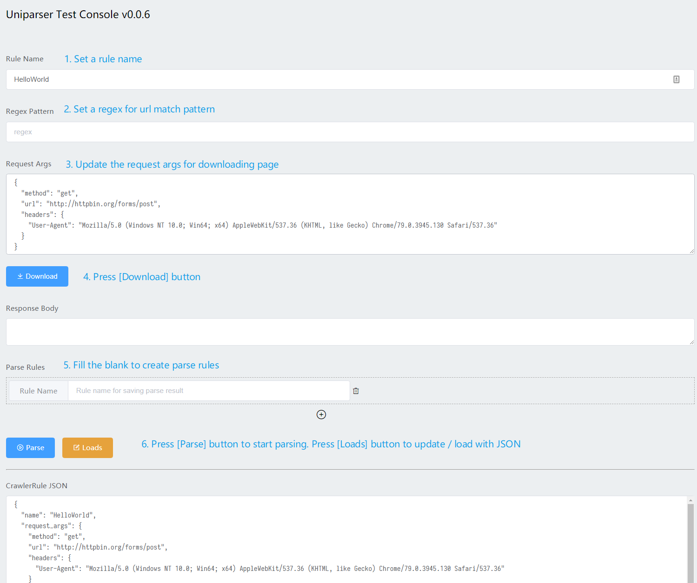

# uniparser [](https://badge.fury.io/py/uniparser)

Provide a universal solution for crawler platforms. Python3.6+ is needed.

## Install

> pip install uniparser -U

## Why?

1. Reduced the code quantity from plenty of similar crawlers & parsers.  Don't Repeat Yourself.
2. Make the parsing process of different parsers persistent.
3. Separating parsing processes from the downloading.
4. Provide a universal solution for crawler platforms.
5. Summarize common string parsing tools on the market.

## Quick Start

```python
# -*- coding: utf-8 -*-
import requests
from uniparser import Uniparser, CrawlerRule, HostRules
from urllib.parse import urlparse


def test_default_usage():

    # prepare for storage
    uni = Uniparser()
    storage = {}
    test_url = 'http://httpbin.org/get'
    crawler_rule = CrawlerRule(
        'test',
        {
            'url': 'http://httpbin.org/get',
            'method': 'get'
        },
        [
            ['objectpath', 'JSON.url', ''],
            ['python', 'getitem', '[:4]'],
            ['udf', '(context.url, input_object)', ''],
        ],
        'https?://httpbin.org/get',
    )
    host = urlparse(test_url).netloc
    hrs = HostRules(host=host)
    hrs.add(crawler_rule)
    json_string = hrs.to_json()
    # print(json_string)
    assert json_string == '{"host": "httpbin.org", "rules": [{"name": "test", "parse_rules": [["objectpath", "JSON.url", ""], ["python", "getitem", "[:4]"], ["udf", "(context.url, input_object)", ""]], "request_args": {"url": "http://httpbin.org/get", "method": "get"}, "regex": "https?://httpbin.org/get"}]}'
    # add HostRules to storage, storage sometimes using in redis
    storage[hrs['host']] = json_string
    # ============================================
    # start to crawl
    # 1. set a example url
    test_url1 = test_url
    # 2. find the HostRules
    json_string = storage.get(host)
    # 3. HostRules init: load from json
    hrs = HostRules.from_json(json_string)
    # print(crawler_rule)
    # 4. now search / match the url with existing rules
    rule = hrs.search(test_url1)
    assert rule == {
        'name': 'test',
        'parse_rules': [['objectpath', 'JSON.url', ''],
                        ['python', 'getitem', '[:4]'],
                        ['udf', '(context.url, input_object)', '']],
        'request_args': {
            'url': 'http://httpbin.org/get',
            'method': 'get'
        },
        'regex': 'https?://httpbin.org/get'
    }
    assert rule == hrs.match(test_url1)
    # 5. download as rule's request_args
    resp = requests.request(**rule['request_args'])
    # 6. parse as rule's parse_rules
    result = uni.parse(resp.text, rule, context=resp)
    # print(result)
    assert result == ('http://httpbin.org/get', 'http')
    # ===================== while search failed =====================
    test_url2 = 'http://notmatch.com'
    rule = hrs.search(test_url2)
    assert rule is None


if __name__ == "__main__":
    test_default_usage()

```

## More Usage

> Talk is cheap, code == doc.  ^_^

Watch the examples: [test_parsers.py](https://github.com/ClericPy/uniparser/blob/master/test_parsers.py)

**Online Web UI for testing is coming soon...**

## Uniparser Test Console Demo

1. pip install bottle uniparser
2. python webui_bottle.py
3. open browser:  http://127.0.0.1:8080/ 




## TODO

- [x] Release to **pypi.org**
- [x] Add **github actions** for testing package
- [x] Web UI for testing rules
- [ ] Complete the whole doc
